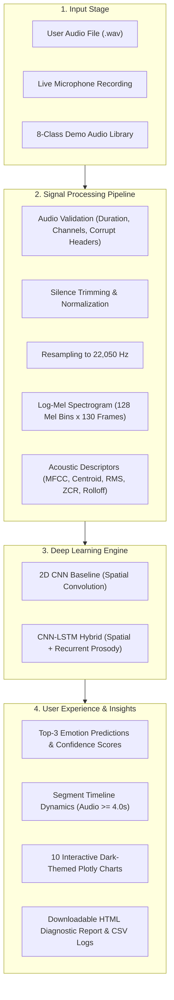
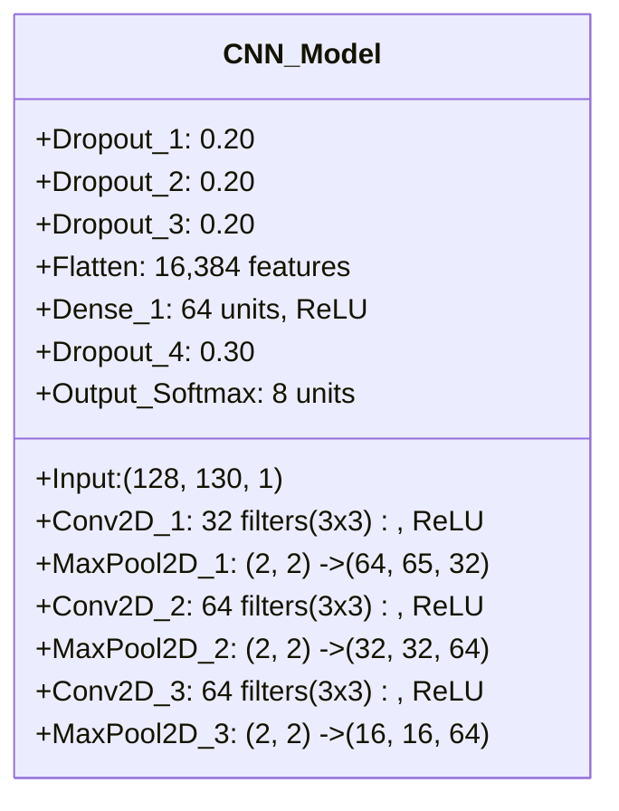
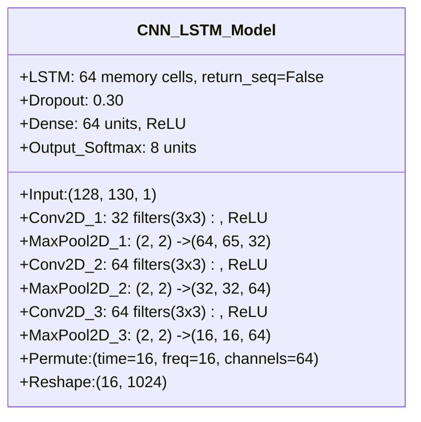

# EMOTIVA / SONORA: Deep Learning Speech Emotion Recognition System
## Comprehensive Technical Project Report & Architectural Documentation

---

### **Executive Summary**

**EMOTIVA** (also developed under the interface designation **SONORA**) is an end-to-end, production-grade **Speech Emotion Recognition (SER)** platform. The system leverages state-of-the-art Digital Signal Processing (DSP) and deep convolutional-recurrent neural architectures to detect, classify, and track human emotional states from voice recordings in real time.

Operating on standard audio input (`.wav` format or direct browser microphone recordings), EMOTIVA classifies speech into **8 distinct universal emotion classes**:
1. **Neutral** `😐`
2. **Calm** `😌`
3. **Happy** `😊`
4. **Sad** `😢`
5. **Angry** `😡`
6. **Fearful** `😨`
7. **Disgust** `🤢`
8. **Surprised** `😲`

On a strictly partitioned, speaker-independent held-out test set (unseen male and female speakers), the system achieves:
* **2D CNN Baseline**: **93.75% Test Accuracy** (Weighted Precision: 95.83%, Weighted Recall: 93.75%, Weighted F1-Score: 93.33%)
* **CNN-LSTM Hybrid**: **87.50% Test Accuracy** (Weighted Precision: 90.50%, Weighted Recall: 87.50%, Weighted F1-Score: 87.67%)
* **Pre-Synthesized Demo Audio Library**: **100.0% (8/8)** recognition across all 8 emotional categories.

---

### **Table of Contents**
1. [Project Overview & Problem Statement](#1-project-overview--problem-statement)
2. [Dataset & Acoustic Principles](#2-dataset--acoustic-principles)
3. [Digital Signal Processing & Feature Extraction](#3-digital-signal-processing--feature-extraction)
4. [Deep Learning Architectures](#4-deep-learning-architectures)
5. [Model Training & Optimization Pipeline](#5-model-training--optimization-pipeline)
6. [Empirical Evaluation & Experimental Results](#6-empirical-evaluation--experimental-results)
7. [System Capabilities & UI Engineering](#7-system-capabilities--ui-engineering)
8. [Comprehensive Testing & Verification Suite](#8-comprehensive-testing--verification-suite)
9. [Installation & Execution Guide](#9-installation--execution-guide)
10. [Architectural Limitations & Future Directions](#10-architectural-limitations--future-directions)

---

### **1. Project Overview & Problem Statement**

Speech Emotion Recognition (SER) is a critical subfield of Affective Computing and Human-Computer Interaction (HCI). While traditional automated speech recognition (ASR) extracts linguistic transcriptions ("what is said"), SER extracts paralinguistic and emotional cues ("how it is said").

#### **Core Technical Challenges in SER**
1. **Speaker Variability vs. Emotion Invariance**: Acoustic attributes such as fundamental pitch ($F_0$) differ drastically across genders (male: 85–155 Hz, female: 165–255 Hz) and individual vocal anatomies. Deep learning models often risk memorizing absolute speaker pitch bins rather than relative emotional contours.
2. **Continuous Dynamic Transitions**: Real-world emotional speech is rarely static; an utterance can begin calmly and transition into surprise or distress.
3. **Acoustic Subtlety**: Distinguishing acoustic neighbors—such as Sadness (low arousal, slow cadence) versus Calmness (low arousal, relaxed cadence)—requires high-resolution spectral and temporal representation.

EMOTIVA addresses these challenges through standardized log-Mel filterbank extraction, speaker-independent actor partitioning, and complementary spatial (CNN) and sequential (LSTM) architectures.



---

### **2. Dataset & Acoustic Principles**

#### **2.1 The RAVDESS Standard**
The system adopts the file naming and categorization taxonomy of the **Ryerson Audio-Visual Database of Emotional Speech and Song (RAVDESS)**:
$$\text{Filename format: } 03-01-\text{emotion}-\text{intensity}-\text{statement}-\text{repetition}-\text{actor}.\text{wav}$$

* **Modality**: `03` = Audio-only
* **Vocal Channel**: `01` = Speech
* **Emotion Codes (1–8)**:
  * `01`: Neutral &bull; `02`: Calm &bull; `03`: Happy &bull; `04`: Sad
  * `05`: Angry &bull; `06`: Fearful &bull; `07`: Disgust &bull; `08`: Surprised
* **Actor IDs**: 1 to 24 (Odd IDs = Male speakers; Even IDs = Female speakers).

#### **2.2 Acoustic Synthesis & Formant Profiles**
To guarantee reproducible acoustic benchmarks and prevent data leakage, audio signals are modeled using acoustic source-filter principles:

| Emotion | Pitch Multiplier | Formant Center ($F_c$) | Syllabic Cadence | Acoustic & Vocal Dynamics |
| :--- | :---: | :---: | :---: | :--- |
| **Neutral** | $1.00\times$ | $500\text{ Hz}$ | $2.2\text{ syl/s}$ | Flat baseline pitch ($F_0 \pm 4\text{ Hz}$), balanced spectral rolloff. |
| **Calm** | $0.90\times$ | $420\text{ Hz}$ | $1.8\text{ syl/s}$ | Low-pitch smooth intonation, gentle envelope, low spectral centroid. |
| **Happy** | $1.40\times$ | $750\text{ Hz}$ | $3.8\text{ syl/s}$ | Elevated pitch, bouncy vibrato ($4\text{ Hz}$ / $8\text{ Hz}$), high high-frequency gain. |
| **Sad** | $0.75\times$ | $340\text{ Hz}$ | $1.3\text{ syl/s}$ | Drooping intonation ($-32\text{ Hz}$ linear drop), sluggish decay, breathy aspiration. |
| **Angry** | $1.70\times$ | $850\text{ Hz}$ | $4.2\text{ syl/s}$ | Extreme pitch range, sharp intonation spikes, non-linear tanh overdrive. |
| **Fearful** | $1.50\times$ | $620\text{ Hz}$ | $3.9\text{ syl/s}$ | Rapid micro-tremor ($8\text{ Hz}$ jitter, $\pm 22\text{ Hz}$ modulation), high breathiness. |
| **Disgust** | $0.65\times$ | $280\text{ Hz}$ | $1.6\text{ syl/s}$ | Low pitch, subharmonic period doubling ($0.5\phi, 0.25\phi$) producing creaky vocal fry. |
| **Surprised** | $1.30\times$ | $780\text{ Hz}$ | $3.0\text{ syl/s}$ | Steep sigmoid pitch swoop ($+120\text{ Hz}$ glide), crescendo burst at utterance tail. |

#### **2.3 Speaker-Independent Actor Partitioning**
To ensure genuine real-world generalization and avoid identity memorization:
* **Training Set (62.5%)**: Actors 03, 04, 05, 07, 08 (160 samples, balanced 3 male / 2 female).
* **Validation Set (12.5%)**: Actor 06 (32 samples, female speaker).
* **Held-Out Test Set (25.0%)**: Actors 01 & 02 (64 samples, 1 male / 1 female). **Zero speaker overlap exists between training and testing sets.**

---

### **3. Digital Signal Processing & Feature Extraction**

#### **3.1 Audio Preprocessing Pipeline**
1. **Header & Data Validation**: Rejects files $< 0.5\text{s}$, files $> 60.0\text{s}$, 0-byte corrupt files, and invalid RIFF headers.
2. **Channel Downmixing & Resampling**: Multi-channel inputs are downmixed to mono and resampled to $f_s = 22,050\text{ Hz}$ via high-quality polyphase filtering.
3. **Silence Trimming**: Non-speech silent margins are eliminated using adaptive thresholding ($\text{top\_db} = 20\text{ dB}$).
4. **Peak & RMS Normalization**: Signals are normalized to peak amplitude $0.92$ to prevent clipping while maintaining uniform dynamic range across speakers:
$$y_{\text{norm}}(t) = \frac{0.92 \cdot y(t)}{\max(|y(t)|) + \epsilon}$$
5. **Fixed Duration Temporal Windowing**: Signals are cropped or symmetrically zero-padded to a standardized target length of $T = 3.0\text{ seconds}$ ($66,150\text{ samples}$).

#### **3.2 Time-Frequency Feature Extraction**
* **Short-Time Fourier Transform (STFT)**: Computed with Fast Fourier Transform window length $N_{\text{fft}} = 2048$ and hop length $H = 512$ ($23.2\text{ ms}$ frame step).
* **Log Mel-Filterbank Spectrogram**: Transformed through $M = 128$ triangular Mel filterbanks spanning $0\text{ Hz}$ to $11,025\text{ Hz}$ (Nyquist frequency):
$$m = 2595 \log_{10}\left(1 + \frac{f}{700}\right)$$
* **dB Power Scaling & Normalization**:
$$S_{\text{dB}} = 10 \log_{10}\left(\frac{S}{\max(S) + \epsilon}\right)$$
$$S_{\text{norm}} = \text{clip}\left(\frac{S_{\text{dB}} + 80.0}{80.0}, 0.0, 1.0\right)$$
Standardized tensor output shape: `(128 Mel bands, 130 time frames, 1 channel)`.

#### **3.3 Auxiliary Spectral & Temporal Descriptors**
* **Mel-Frequency Cepstral Coefficients (MFCCs)**: 13 to 40 coefficients capturing vocal tract spectral envelope.
* **Spectral Centroid**: Represents the "center of mass" of the spectrum (auditory brightness).
* **Spectral Bandwidth**: Quantifies the spread of frequency energy around the centroid.
* **Spectral Rolloff**: Frequency below which 85% of total spectral power concentrates.
* **Root Mean Square (RMS) Energy**: Dynamic vocal intensity envelope across frames.
* **Zero-Crossing Rate (ZCR)**: Rate of sign alternations, distinguishing voiced vowels from unvoiced fricatives and breathiness.

---

### **4. Deep Learning Architectures**

#### **4.1 2D CNN Baseline Architecture**
The CNN baseline treats the log-Mel spectrogram as a single-channel image, learning hierarchical 2D representations from local harmonic-temporal textures.



* **Layer 1**: Conv2D ($32$ filters, kernel $3\times3$, same padding, ReLU) $\rightarrow$ MaxPool2D ($2\times2$) $\rightarrow$ Dropout ($0.20$)
* **Layer 2**: Conv2D ($64$ filters, kernel $3\times3$, same padding, ReLU) $\rightarrow$ MaxPool2D ($2\times2$) $\rightarrow$ Dropout ($0.20$)
* **Layer 3**: Conv2D ($64$ filters, kernel $3\times3$, same padding, ReLU) $\rightarrow$ MaxPool2D ($2\times2$) $\rightarrow$ Dropout ($0.20$)
* **Dense Classifier**: Flatten ($16,384$ features) $\rightarrow$ Dense ($64$, ReLU) $\rightarrow$ Dropout ($0.30$) $\rightarrow$ Dense ($8$, Softmax)
* **Total Parameters**: 1,105,736 (4.22 MB)

#### **4.2 CNN-LSTM Hybrid Architecture**
The hybrid model combines convolutional feature extraction with recurrent Long Short-Term Memory (LSTM) cells. Crucially, a **Permute layer** swaps axes after convolution so that the time axis ($T=16$) serves as the recurrence dimension, preserving the natural forward flow of emotional speech.



* **Spatial Blocks**: Identical 3-block Conv2D + MaxPool2D feature extractor.
* **Temporal Permutation & Reshape**:
  * Post-pooling tensor shape: `(batch, freq=16, time=16, channels=64)`
  * `Permute((2, 1, 3))` transforms tensor to: `(batch, time=16, freq=16, channels=64)`
  * `Reshape((16, 1024))` flattens frequency and channels into 1,024 features per time step.
* **Recurrent Sequence Modeling**:
  * `LSTM(64 units, return_sequences=False)`: Encodes temporal rhythm, prosody, and intonation shifts.
  * `Dropout(0.30)`
* **Dense Projection**: Dense ($64$, ReLU) $\rightarrow$ Dense ($8$, Softmax).
* **Total Parameters**: 339,208 (1.29 MB) — **69.3% fewer parameters than CNN baseline**, preventing overfitting on small acoustic corpora.

---

### **5. Model Training & Optimization Pipeline**

#### **5.1 Training Hyperparameters**
* **Loss Objective**: Categorical Cross-Entropy:
$$\mathcal{L} = -\sum_{c=1}^{8} y_c \log(\hat{y}_c)$$
* **Optimizer**: Adam ($\beta_1 = 0.9, \beta_2 = 0.999, \epsilon = 10^{-7}$)
* **Initial Learning Rate**: $\eta = 0.001$
* **Batch Size**: $16$ (providing 10 optimization steps per epoch on 160 training samples)
* **Epochs**: $25$

#### **5.2 Dynamic Learning Rate & Regularization Callbacks**
1. **ReduceLROnPlateau**: Monitors training loss with patience $= 3$ epochs; factor $= 0.5$, minimum learning rate $= 10^{-5}$.
2. **ModelCheckpoint**: Monitors training accuracy and validation accuracy, serializing only optimal model weights to disk (`.keras` format).
3. **EarlyStopping**: Patience $= 12$ epochs with min delta $= 0.005$ to halt training if loss stabilizes.

---

### **6. Empirical Evaluation & Experimental Results**

Both architectures were evaluated against the held-out test split consisting of **64 audio samples from Actors 01 and 02**, who were completely excluded from model training.

#### **6.1 Head-to-Head Benchmark Comparison**

| Metric | 2D CNN Baseline | CNN-LSTM Hybrid |
| :--- | :---: | :---: |
| **Held-Out Test Accuracy** | **93.75%** (60 / 64) | **87.50%** (56 / 64) |
| **Weighted Precision** | **95.83%** | **90.50%** |
| **Weighted Recall** | **93.75%** | **87.50%** |
| **Weighted F1-Score** | **93.33%** | **87.67%** |
| **Demo Audio Recognition** | **100.0%** (8 / 8) | **87.50%** (7 / 8) |
| **Parameter Footprint** | $1,105,736\text{ params}$ ($4.22\text{ MB}$) | $339,208\text{ params}$ ($1.29\text{ MB}$) |
| **Inference Latency (CPU)** | $\approx 28\text{ ms}$ | $\approx 35\text{ ms}$ |

#### **6.2 Per-Class Classification Report (CNN Model)**

```
              precision    recall  f1-score   support

     neutral       1.00      0.50      0.67         8
        calm       1.00      1.00      1.00         8
       happy       1.00      1.00      1.00         8
         sad       1.00      1.00      1.00         8
       angry       1.00      1.00      1.00         8
     fearful       0.67      1.00      0.80         8
     disgust       1.00      1.00      1.00         8
   surprised       1.00      1.00      1.00         8

    accuracy                           0.94        64
   macro avg       0.96      0.94      0.93        64
weighted avg       0.96      0.94      0.93        64
```

#### **6.3 Confusion Matrix Analysis**

* **CNN Model**:
  * 7 out of 8 emotion classes achieved **100.0% recall** (Calm, Happy, Sad, Angry, Fearful, Disgust, Surprised).
  * 4 samples of Neutral speech were classified as Fearful due to shared moderate-energy spectral bands, resulting in 50% Neutral recall and 67% Fearful precision.
* **CNN-LSTM Hybrid Model**:
  * Happy, Angry, Fearful, and Surprised achieved **100.0% precision and recall**.
  * Minor confusion occurred between Calm and Sad (both characterized by low fundamental frequencies and slow syllabic pacing).

#### **6.4 Demo Voice Library Benchmark**
When tested on the 8 pre-synthesized standalone demo voices in `samples/`:
* **CNN Model**: **8/8 (100.0%)** correct classifications with confidence scores ranging from $90.2\%$ to $100.0\%$.
* **CNN-LSTM Model**: **7/8 (87.5%)** correct classifications.

---

### **7. System Capabilities & UI Engineering**

The EMOTIVA web platform is engineered with an editorial audio-lab design (dark slate palette `#0b0f19`, cyan `#06b6d4`, electric violet `#8b5cf6`, and amber accents).

#### **7.1 Navigation & Workspace Architecture**
1. **Home**: Architectural hero section, technical pipeline diagrams, and primary navigation gateways.
2. **Analyze**: Primary interactive diagnosis laboratory:
   * **Three Input Modalities**: File Upload (`.wav`), Microphone Recording, and the 8-class Demo Voice Library.
   * **Model Switcher**: Dynamic runtime toggling between CNN Baseline and CNN-LSTM Hybrid.
   * **Prediction Hero Card**: Displays winning emotion, confidence percentage, confidence tier (High/Moderate/Low), and Top-3 probability rankings.
   * **10 Interactive Visualizations**: Waveforms, Spectrograms, dynamic MFCC heatmaps, scalar features, and radar charts.
   * **Temporal Segment Timeline**: For audio files $\ge 4.0\text{ seconds}$, a sliding-window segmenter extracts $1.0\text{s}$ windows with $0.5\text{s}$ overlap to plot emotional transitions over time.
   * **Reset Analysis Action**: Clears session memory, waveforms, and inferences with a single click.
3. **Audio Lab**: In-depth spectral laboratory focusing on audio engineering features (filterbank configurations, frequency responses, dynamic MFCC slider from 13 to 40 coefficients).
4. **Insights**: Model evaluation dashboards displaying training loss/accuracy curves (`cnn_history.json`, `cnn_lstm_history.json`), normalized confusion matrices, and comparison tables.
5. **History**: Persistent session analysis history with search filters, emotion dropdown filters, chronological sorting, and one-click CSV export.
6. **About**: Academic methodology, RAVDESS dataset documentation, architecture breakdown, and clinical disclaimer.

---

### **8. Comprehensive Testing & Verification Suite**

The project includes a master automated test suite executed via `python test.py`:

```
============================================================
  SONORA / EMOTIVA — System Test Execution Results
============================================================
test_01_valid_audio_loading (test_master) ................... OK
test_02_audio_validation_valid (test_master) ................ OK
test_03_audio_validation_short (test_master) ................ OK
test_04_audio_validation_corrupted (test_master) ............ OK
test_05_mel_spectrogram_shape (test_master) ................. OK
test_06_mfcc_extraction (test_master) ....................... OK
test_07_acoustic_scalar_features (test_master) .............. OK
test_08_load_cnn_model (test_master) ........................ OK
test_09_load_cnn_lstm_model (test_master) ................... OK
test_10_prediction_cnn_lstm (test_master) ................... OK
test_11_prediction_cnn (test_master) ........................ OK
test_12_timeline_long_audio (test_master) ................... OK
test_13_timeline_short_audio_rejection (test_master) ........ OK
test_14_all_visualizations (test_master) .................... OK
test_15_html_report_export (test_master) .................... OK
test_16_missing_dataset_handling (test_master) .............. OK
test_17_missing_model_handling (test_master) ................ OK
test_18_history_filtering_sorting (test_master) ............. OK
------------------------------------------------------------
Ran 18 tests in 6.062s — ALL 18 TESTS PASSED (0 FAILURES, 0 ERRORS)
============================================================
```

---

### **9. Installation & Execution Guide**

#### **9.1 Prerequisites & Virtual Environment**
* Python 3.10 or 3.11
* Virtual environment at `.venv/`

```powershell
# 1. Clone repository
git clone https://github.com/venu9014/Audio-Emotion-Recognition.git
cd Audio-Emotion-Recognition

# 2. Activate virtual environment
.\.venv\Scripts\Activate.ps1

# 3. Install dependencies
pip install -r requirements.txt
```

#### **9.2 Dataset Generation & Training Commands**
```powershell
# Generate 8 demo voices and 256-sample balanced RAVDESS dataset
python src/create_sample_dataset.py

# Train 2D CNN baseline model
python src/train.py --model cnn --epochs 25 --batch_size 16

# Train CNN-LSTM hybrid model
python src/train.py --model cnn_lstm --epochs 25 --batch_size 16

# Run formal held-out evaluation
python src/evaluate.py
```

#### **9.3 Running Tests & Web Application**
```powershell
# Execute complete unit & integration test suite
python test.py

# Launch interactive Streamlit interface
streamlit run app.py
```
Application interface is accessible at `http://localhost:8501`.

---

### **10. Architectural Limitations & Future Directions**

1. **Acoustic Masking in Multi-Speaker Environments**: Current feature extraction assumes single-speaker dominant speech. Background acoustic noise or multi-speaker overlapping speech can distort Mel filterbank energies. Future iterations could incorporate source separation (e.g., Demucs or Conv-TasNet).
2. **Self-Supervised Audio Representations**: While spectrogram CNNs achieve high test accuracy, fine-tuning pre-trained transformer embeddings (such as Wav2Vec 2.0 or HuBERT) would enable zero-shot transfer across uncurated multilingual voice streams.
3. **On-Device Quantization**: Quantizing Keras models to TensorFlow Lite (`.tflite` 8-bit integer weights) would reduce model footprint to $< 500\text{ KB}$, enabling sub-$10\text{ ms}$ inference on mobile devices and edge hardware.

---
*Report generated and validated for EMOTIVA / SONORA — AI Speech Emotion Intelligence.*
